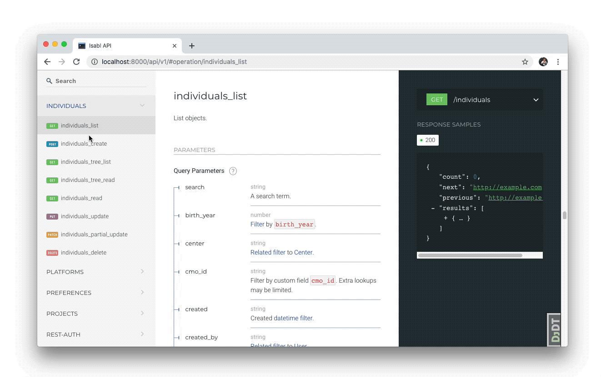

# Registering Metadata

## Isabl Data Model

`Isabl` models a data generation process where _Experiments_ such as Whole Genome Sequencing are performed on _Samples_ collected from different _Individuals_. This normalization approach reduces data redundancy and improves data integrity.







Unique together constraints enable Isabl link new samples and experiments to existing records in the database. The following fields are enforced to be unique together across the entire system:

| Database Schema | Unique Together Fields |
| :--- | :--- |


<table>
  <thead>
    <tr>
      <th style="text-align:left"><b>Individual</b>
      </th>
      <th style="text-align:left">
        <ul>
          <li>Center</li>
          <li>Species</li>
          <li>Identifier</li>
        </ul>
      </th>
    </tr>
  </thead>
  <tbody></tbody>
</table><table>
  <thead>
    <tr>
      <th style="text-align:left"><b>Samples</b>
      </th>
      <th style="text-align:left">
        <ul>
          <li>Individual</li>
          <li>Sample Class</li>
          <li>Identifier</li>
        </ul>
      </th>
    </tr>
  </thead>
  <tbody></tbody>
</table><table>
  <thead>
    <tr>
      <th style="text-align:left"><b>Experiments</b>
      </th>
      <th style="text-align:left">
        <ul>
          <li>Sample</li>
          <li>Aliquot ID</li>
          <li>Technique</li>
          <li>Identifier</li>
        </ul>
      </th>
    </tr>
  </thead>
  <tbody></tbody>
</table>







The concept of cohorts, where multiple _Experiments_ are grouped and analyzed together, is fundamental and well supported. Furthermore, `isabl` also tracks and executes _Assembly_ aware _Bioinformatics Applications_ making sure that results are a function of the reference genome. Instances of these applications are also tracked and referred as _Analyses_.


## Metadata Registration

Isabl offer different mechanisms for metadata registration.



Only users with the proper permissions or _superusers_ can create or modify models in the database, by using any of the methods for metadata registration.

When using the web interface, available buttons such as **Create New Submission \(+\)** may be hidden depending of your user role. If you're not seeing this feature, or your getting _permission denied_ using the API, please contact your `isabl` administrators.


## Adding Extra Choices

If you need more choices for `species`, `gender`, sample `category`, and technique `methods`, please refer to the [extra choices documentation](isabl-settings.md#extra-choices-settings).

## Register Samples with Excel

Through the web interface, is possible to import an _Excel Submission_ to register new samples.


Note that this feature is limited to create only new _Individuals_, _Samples_ and _Experiments_. If you need to create _Centers_, _Diseases_, _Techniques_, _Platforms_, for your available choices you need to use the **Admin** interface at `http://<your-isabl-host>/admin/`or the [API method](data-model.md#register-samples-with-restful-api-and-cli).


By clicking in **Create New Submission** button in the top right menu of the user, or by clicking in **Add Batch Samples** in the top right button of the Project view.


It will open a modal where you can download the latest _Submission_ form by clicking **GET FORM.** By latest, it means it will be updated with the available custom fields, and available choices added to options like: center, diseases, platforms and techniques.


When prompted to allow _macros_, say yes. This will enable you to toggle between optional and required columns.



After the submission is created it can be uploaded through the web interface and a preliminary summary from the metadata submitted will be shown. This Information about the number of models that will be created \(i.e. _1 Individual, 2 Samples, 4 Experiments_\) or errors in the submission form fields \(i.e. _Error: individual gender FMALE is not a valid choice_\) guides you in the submission process, before you can commit it.


After uploading the submission file, if you don't get any validation errors and your summary looks correct, hit the **Commit Submission** button to register the submission and make definitive changes in the database.



After committing your _Submission,_ your new available samples should've been created by now, and you can visualize in the _Sample Tree_ the relationship between the new models you just registered.


## Register Samples with RESTful API and CLI

`Isabl` comes with a comprehensive RESTful API reference, where you can learn how to use every available endpoint for each resource of the database. You can access it by browsing to `http://<your-isabl-host>/api/v1/`



Create endpoints are _get or create_, they try to retrieve existing objects using either the _primary key_ field or _unique together constraints_, and if it doesn't find a match creates a new object. If the view supports nested objects, these will also be retrieved or created using the same criteria.


**IMPORTANT**: If an existing object is retrieved, its fields won't be updated with the posted data.


Let's say you want to create a new _Individual._ According to the API documentation, we need to provide at  species, gender, an identifier, and the center associated with the individual. Note that `center` is a _nested_  object, you may need to create a new one or query an existing one. Let's say you want to get an existing one. This is how you'd do it with `isabl_cli`:



```python
import isabl_cli as ii

center = ii.get_instance(
    'centers',
    'MEMORIAL SLOAN KETTERING (MSK)',
)
individual = ii.create_instance(
    'individuals',
    identifier = 'EXTERNAL_ID_1',
    species = 'HUMAN',
    gender = 'FEMALE',
    center = center,
)
```



You can also make http requests directly to the API \(you can create a new token from the admin site\):



```bash
# get token for authentication
curl  -X POST  \
    -d '{ "username": <your-username>, "password": <your-password> }'
    -H "Content-Type: application/json"  \
    http://<your-isabl-host>/api/v1/rest-auth/login/

# create individual
curl \
    -X POST \
    -H 'Authorization: Token <your-token>' \
    -H "Content-Type: application/json" \
    -d '{"identifier": "EXTERNAL_ID_1", "species": "HUMAN", "gender": "FEMALE", "center": {"acronym": "MSK", "name": "MEMORIAL SLOAN KETTERING" } }' \
    http://<your-isabl-host>/api/v1/individuals
```



## Manage User Groups and Permissions

Isabl offers an optional configuration of groups that you can adopt:

| Group | Permissions |
| :--- | :--- |
| **Managers** | Can create, update, and delete Custom Fields, Individuals, Centers, Diseases, Experiments, Techniques, Platforms, Projects, and Submissions. |
| **Analysts** | Can create, update, and delete Custom Fields, Applications, Analyses, and Assemblies. They can also download analyses results. |
| **Engineers** | Engineers have the same permissions of both managers and analysts. |

 In order to create these groups run the following command:

```bash
python manage.py create_default_groups
```


These groups are **optional** and you can create your own using the Django Admin.


