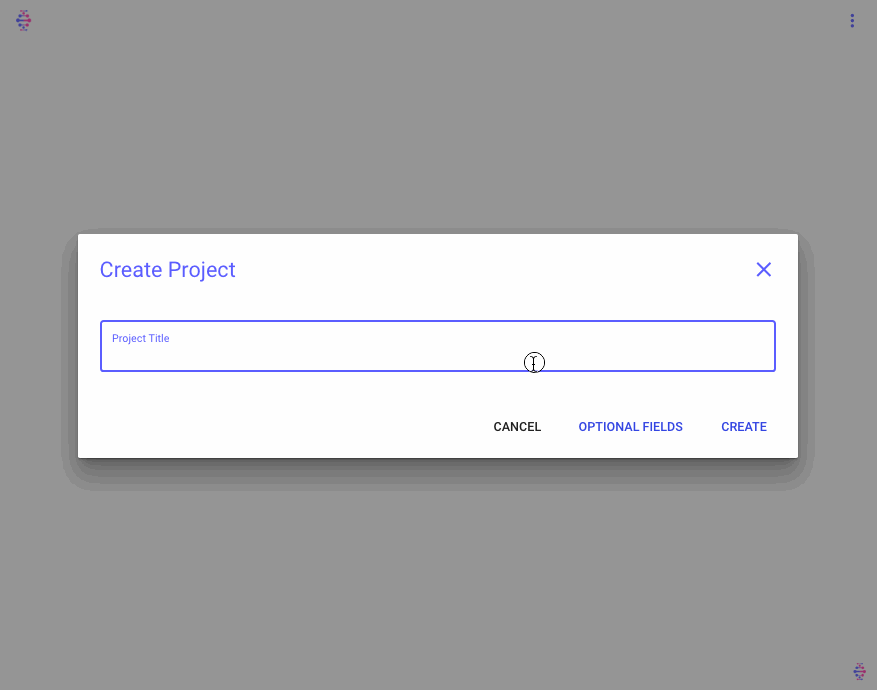
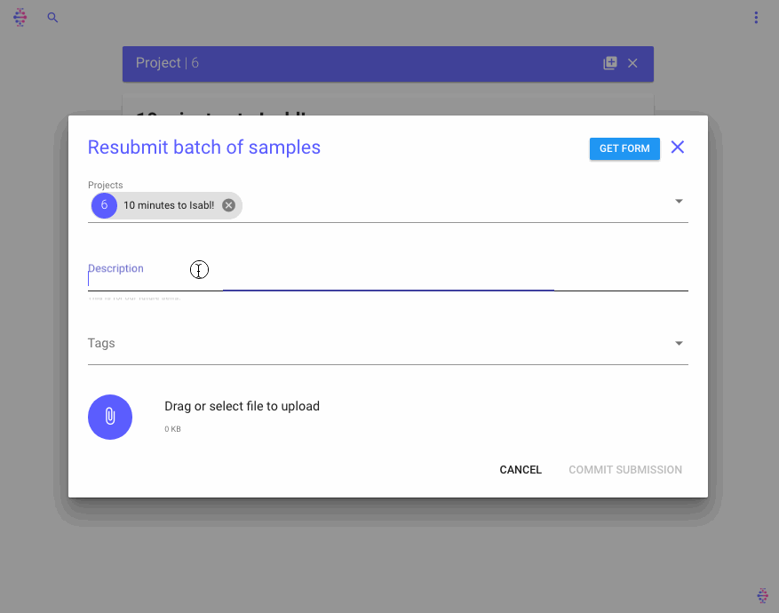

<div style="text-align: right"> ⏱ <b>tutorial time:</b> 10 minutes </div>

# Quick Start

Welcome to Isabl's 10 minute demo. This tutorial will walk you through:

- [Prerequisites](#prerequisites)
- [Installation](#installation)
- [Create project](#create-project)
- [Register samples](#register-samples)
- [Import data](#import-data)
- [Register reference fasta and BED](#register-reference-fasta-and-bed)
- [Run applications](#run-applications)
- [Retrieve and visualize results](#retrieve-and-visualize-results)
- [Wrap up and next steps](#wrap-up-and-next-steps)

## Prerequisites

- [Docker Compose] for building and running the application.
- [Virtualenvwrapper] and `python>=3.6` for the Command Line Interface.

## Installation

First, clone the demo setup using:

```bash
git clone https://github.com/isabl-io/demo.git && cd demo
```

We have bootstrapped a production-ready django project using [cookiecutter-isabl], lets proceed to build and run the application (this might take a few minutes):

```bash
cd isabl_demo               # go to your project directory
docker-compose build        # build with docker-compose
docker-compose up           # now run the application
```

You will need to create a new user before you can access the system, on a new console run:

```bash
# run on a separate terminal window from the project directory
docker-compose run --rm django python manage.py createsuperuser
```

Visit your browser at http://localhost:8000/ and log in! Lastly, install the [isabl-cli] in an isolated virtual environment:

```bash
mkvirtualenv -p python3 isabl_demo       # optional but strongly recommended
pip3 install isabl-cli                   # install client
```

?> **Note:** use `workon` to activate a virtual environment, deactivate with `deactivate`. [cookiecutter-isabl] is a proud fork of [cookiecutter-django]! Many topics from their [guide] are relevant to your project.

## Create project

Creating a project in Isabl is as simple as adding a title. You can also specify optional fields:



## Register samples

Before we create samples, lets use `isabl-cli` to add choices for *Center*, *Disease*, *Sequencing Technique*, and *Sequencing Platform*:

```bash
# use simple script to create new choices
python ./assets/metadata/create_choices.py
```

?> New options can also be easily created using the admin site: http://localhost:8000/admin

Now lets add samples from the frontend:



## Import data

Lets proceed to import data for the samples we just created. Download the test data, import it and retrieve paths from API:

```bash
# import data for test samples
isabl import_data \
    -di ./assets             `# provide data location ` \
    -fi tags demo            `# filter samples to be imported ` \
    -id sample.research_id   `# match files using samples research id`

# retrieve new data locations from api
isabl get_sequencing_data -fi sample.research_id demo_normal
```

Note that data is stored in your home directory, learn about [CLI advanced configuration] to customize functionality.

## Register reference fasta and BED

## Run applications

## Retrieve and visualize results

## Wrap up and next steps

?> You can type <kbd>Ctrl</kbd>+<kbd>C</kbd> to stop the application.

?> Ready for **production**? learn more about [deployment].

<!-- local -->
[CLI advanced configuration]: guides/cli#configuration
[deployment]: tutorials/deployment

<!-- dependencies -->
[guide]: https://cookiecutter-django.readthedocs.io/en/latest/developing-locally-docker.html#
[full documentation]: https://cookiecutter-django.readthedocs.io/en/latest
[docker compose]: https://docs.docker.com/compose/install/
[virtualenvwrapper]: https://virtualenvwrapper.readthedocs.io/en/latest/install.html#basic-installation
[cookiecutter]: https://github.com/audreyr/cookiecutter
[cookiecutter-django]: https://github.com/pydanny/cookiecutter-django
[cookiecutter-isabl]: https://isabl-io.github.io/docs/#/api/settings
[isabl-cli]: https://isabl-io.github.io/docs/#/cli
[cookiecutter]: https://github.com/audreyr/cookiecutter
