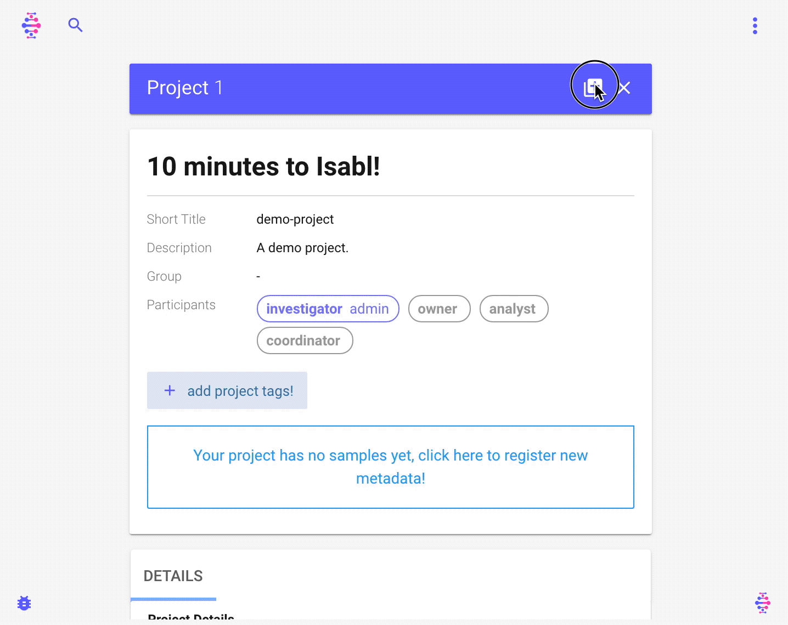

# Quick Start

Welcome to the _10 Minutes to Isabl_ guide! This tutorial will walk you through installation, meta data registration, data import, and automated data processing.

### Prerequisites

* [Docker Compose](https://docs.docker.com/compose/install/) for building and running the application.

### Demo setup

Let's start by clone the demo:

```bash
git clone https://github.com/isabl-io/demo.git --recurse-submodules && cd demo
```

Next, source a simple initiation profile:

```bash
source .demo-profile
```

### Installation

Build and run the application \(this might take a few minutes\):

```bash
demo-compose build
```

Now we can run the application in the background:

```bash
demo-compose up -d
```


You can type `demo-compose down` to stop the application.


You will need to create a new user before you can access the system:

```bash
demo-django createsuperuser
```

Visit your browser at [http://localhost:8000/](http://localhost:8000/) and log in!


`demo-compose`, `demo-django`, and `demo-cli` are simple wrappers around `docker-compose`, check them out. The `isabl_demo` directory was bootstrapped using [cookiecutter-isabl](https://isabl-io.github.io/docs/#/api/settings), a proud fork of [cookiecutter-django](https://github.com/pydanny/cookiecutter-django)! Many topics from their [guide](https://cookiecutter-django.readthedocs.io/en/latest/developing-locally-docker.html#) will be relevant to your project.


### Create project

Creating a project in Isabl is as simple as adding a title. You can also specify optional fields:


### Register samples

Before we create samples, let's use `isabl-cli` to add choices for _Center_, _Disease_, _Sequencing Technique_, and _Sequencing Platform_:

```bash
demo-cli python3.6 assets/metadata/create_choices.py
```


New options can also be easily created using the admin site: [http://localhost:8000/admin/](http://localhost:8000/admin/)


We will use _Excel submissions_ to register samples through the web interface. To do so, the demo project comes with a pre-filled metadata form available at:

```bash
open assets/metadata/demo_submission.xlsm
```


When prompted to allow _macros_, say yes. This will enable you to toggle between optional and required columns. By the way, Isabl has multiple mechanisms for metadata ingestion! Learn more [here](data-model.md).


Now let's proceed to submit this excel form:



We can also review metadata at the command line:

```bash
isabl get-metadata experiments --fx
```


Expand and navigate with arrow keys, press e to _expand all_ and E to minimize. Learn more at [`fx` documentation](https://github.com/antonmedv/fx/blob/master/docs.md#interactive-mode). Use `--help` to learn about other ways to visualize metadata \(e.g. `tsv`\).


### **Import** reference data

Given that `isabl-cli` will move our test data, let's copy original assets into a _staging_ directory:

```bash
mkdir -p assets/staging && cp -r assets/data/* assets/staging
```

Now let's import the genome:

```bash
isabl import-reference-genome \
    --assembly GRCh37 \
    --species HUMAN  \
    --genome-path assets/staging/reference/reference.fasta
```

We can also import BED files for our demo _Sequencing Technique_:

```bash
isabl import-bedfiles \
    --technique DEMO_TECHNIQUE \
    --targets-path assets/staging/bed/targets.bed \
    --baits-path assets/staging/bed/baits.bed \
    --assembly GRCh37 \
    --species HUMAN \
    --description "Demo BED files"
```

Check that import was successful:

```bash
isabl get-bed DEMO_TECHNIQUE  # retrieve BED file
isabl get-reference GRCh37    # retrieve reference genome
```

### Import experimental data

Next step is to import data for the samples we just created:

```bash
isabl import-data \
    -di ./assets/staging             `# provide data location ` \
    -id research_id                  `# match files using experiment research id`
    -fi research_id.contains "demo"  `# filter samples to be imported ` \
```

Retrieve imported data for the normal to see how directories are created:

```bash
isabl get-data -fi sample.research_id "demo normal"
```

The front end will also reflect that data has been imported.

### Alignment applications

Isabl is a language agnostic platform and can deploy any pipeline. To get started, we will use some applications from [isabl-io/apps](https://github.com/isabl-io/apps). Precisely we will run alignment, quality control, and variant calling. Applications are registered in the configuration

```bash
cat config/settings.py
```

Once registered, they are available in the client:

```bash
isabl apps-grch37
```

First we'll run alignment \(pass `--commit` to deploy\):

```bash
isabl apps-grch37           `# apps are grouped by assembly ` \
    bwa-mem-0.7.17.r1188    `# run bwa-mem version 0.7.17.r1188 ` \
    -fi tags.contains data  `# filter using tags, feel free to try others ` \
    --verbose               `# we want to see verbose output ` \
```


Note that if you try to re-run the same command, Isabl will notify you that results are already available.


Now we can retrieve bams from the command line:

```bash
isabl get-bams -fi sample.individual.research_id "demo individual"
```

We can also visualize aligned bams online:


Insert `2:123,028-123,995` in the locus bar, that's were our test data has reads.


**GIF TODO**

### Project level analyses

Let's get some stats of our experiments with a quality control application:

```bash
isabl apps-grch37 qc-data-0.1.0 --verbose -fi research_id.icontains demo --commit
```

Isabl can render multiple types of results, in this case we will check at HTML reports.

**GIF TODO**

This example show cases a very strong feature of Isabl, Project Level Auto-Merge. The quality control app has logic to create a project level result automatically:

**GIF TODO**

Applications can define any custom logic to merge analyses.

### Multi-experiment analyses

Up until now we've run applications that are linked to one experiment only. However, analyses can be related to any number of _target_ and _reference_ experiments. For example this implementation of strelka uses _tumor-normal_ pairs. Before you can run this command you will need to retrieve the system id of your experiments, let's try:

```bash
isabl get-metadata experiments -f system_id
```

Now insert those identifiers in the following command:

```bash
isabl apps-grch37 strelka-2.9.1 --verbose \
    --pairs {TUMOR 1 ID} {NORMAL ID}  `# replace tumor 1 system id and normal system id` \
    --pairs {TUMOR 1 ID} {NORMAL ID}  `# replace tumor 2 system id and normal system id` \
```

You can retrieve registered results for the analysis, for instance the indels VCF:

```bash
isabl get-results -fi name STRELKA --result-key indels
```

Furthermore, you can get paths for any instance in the database using `get-paths`:

```bash
isabl get-paths analyses -fi name STRELKA
```

### Wrap up and next steps

* Learn about [CLI advanced configuration](guides/cli#configuration) to customize functionality.
* Ready for **production**? learn more about [deployment](tutorials/deployment).

