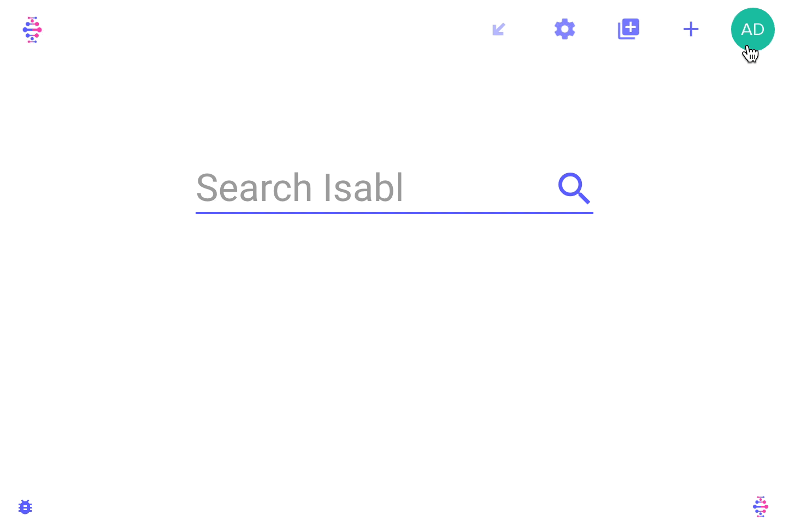
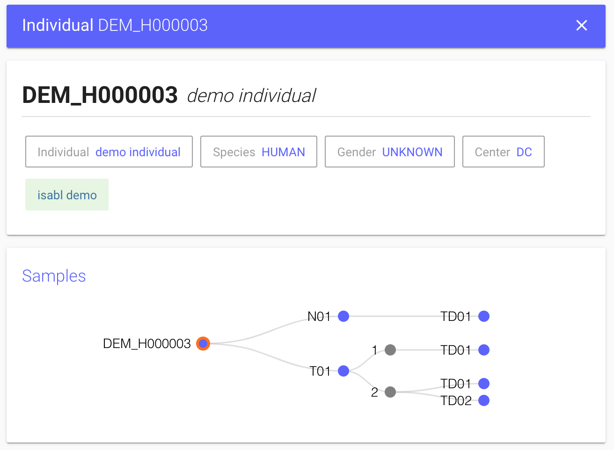
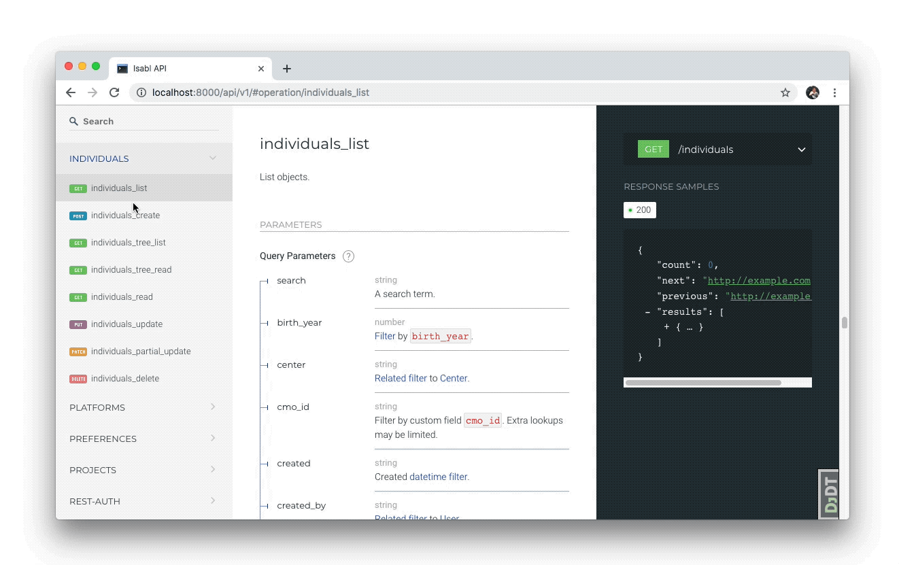
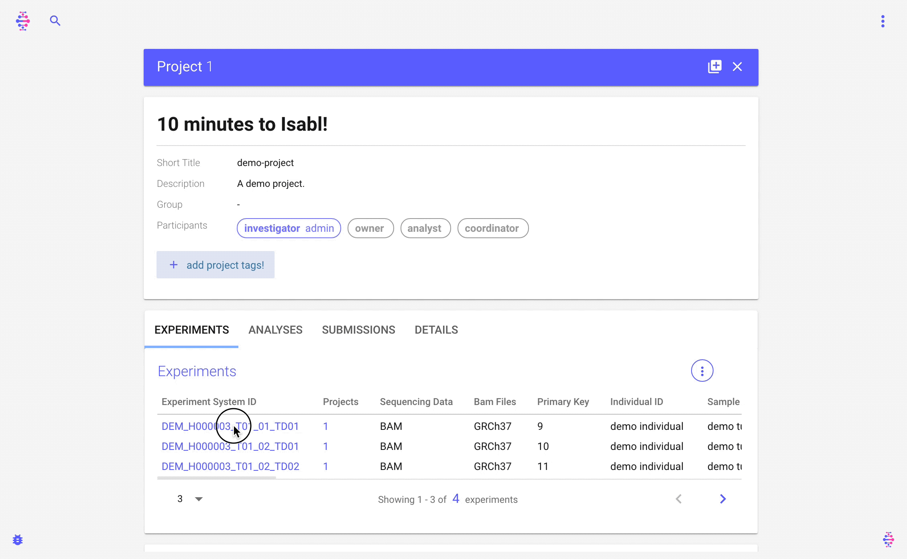

# Quick Start

Welcome to the _10 Minutes to Isabl_ guide! This tutorial will walk you through installation, meta data registration, data import, and automated data processing.


This tutorial is tailored for _engineers_ learning about Isabl. If you are an end-user \(i.e. analyst, project manager\), you are very welcome to follow this tutorial! But we also recommend you to explore the [Retrieve Data](retrieve-data.md) and [Register Metadata](data-model.md) guides.



* Join us on [Gitter](https://gitter.im/isabl-io/community) if you have questions
* Submit an [issue](https://github.com/isabl-io/demo/issues/new) 🐛 if you are having  problems with this guide


### Intro to Isabl

Checkout the documentation [home](./) page for an intro to Isabl.


### Prerequisites

* [Docker Compose](https://docs.docker.com/compose/install/) for building and running the application.

### Demo Setup

Let's start by clone the demo:

```bash
git clone https://github.com/isabl-io/demo.git --recurse-submodules && cd demo
```

Next, source a simple initiation profile:

```bash
source .demo-profile
```


If you are **redoing** the tutorial, we recommend to remove the demo directory and clone it again:

```bash
chmod -R u+w demo && rm -rf demo 
```

Also remove the Docker volume:

```bash
docker volume rm isabl_demo_local_postgres_data
```


### Installation

Build and run the application \(this might take a few minutes\):

```bash
demo-compose build
```

Now we can run the application in the background:

```bash
demo-compose up -d
```


You can type `demo-compose down` to stop the application.


You will need to create a new user before you can access the system:

```bash
demo-django createsuperuser --username admin --email admin@mskcc.org
```

Visit your browser at [http://localhost:8000/](http://localhost:8000/) and log in!


`demo-compose`, `demo-django`, and `demo-cli` are simple wrappers around `docker-compose`, check them out. The `isabl_demo` directory was bootstrapped using [cookiecutter-isabl](https://isabl-io.github.io/docs/#/api/settings), a proud fork of [cookiecutter-django](https://github.com/pydanny/cookiecutter-django)! Many topics from their [guide](https://cookiecutter-django.readthedocs.io/en/latest/developing-locally-docker.html#) will be relevant to your project.


### Create Project

Creating a project in Isabl is as simple as adding a title. You can also specify optional fields:



### Register Samples

Before we create samples, let's use `isabl-cli` to add choices for _Center_, _Disease_, _Sequencing Technique_, and _Sequencing Platform_:

```bash
demo-cli python3.6 assets/metadata/create_choices.py
```


New options can also be easily created using the admin site: [http://localhost:8000/admin/](http://localhost:8000/admin/)


We will use _Excel submissions_ to register samples through the web interface. To do so, the demo project comes with a pre-filled metadata form available at:

```bash
open assets/metadata/demo_submission.xlsm
```


When prompted to allow _macros_, say yes. This will enable you to toggle between optional and required columns. By the way, Isabl has multiple mechanisms for metadata ingestion! Learn more [here](data-model.md).


Now let's proceed to submit this excel form:


We can also review metadata at the command line:

```bash
isabl get-metadata experiments --fx
```


Expand and navigate with arrow keys, press e to _expand all_ and E to minimize. Learn more at [`fx` documentation](https://github.com/antonmedv/fx/blob/master/docs.md#interactive-mode). Use `--help` to learn about other ways to visualize metadata \(e.g. `tsv`\).


For this particular demo, we wanted to create a _sample tree_ that showcases the flexibility of Isabl's data model. Our demo individual has two samples, one normal and one tumor. The tumor sample is further divided into two biological replicates \(or _aliquots_\), and two experiments where conducted on the second aliquot:



### RESTful API

Although not required for this tutorial, you are welcome to checkout the RESTful API documentation at: [http://localhost:8000/api/v1/](http://localhost:8000/api/v1/)



### **Import** Reference Data

Given that `isabl-cli` will move our test data, let's copy original assets into a _staging_ directory:

```bash
mkdir -p assets/staging && cp -r assets/data/* assets/staging
```

Now let's import the genome:

```bash
isabl import-reference-genome \
    --assembly GRCh37 \
    --species HUMAN  \
    --genome-path assets/staging/reference/reference.fasta
```

We can also import BED files for our demo _Sequencing Technique_:

```bash
isabl import-bedfiles \
    --technique DEMO_TECHNIQUE \
    --targets-path assets/staging/bed/targets.bed \
    --baits-path assets/staging/bed/baits.bed \
    --assembly GRCh37 \
    --species HUMAN \
    --description "Demo BED files"
```

Check that import was successful:

```bash
isabl get-bed DEMO_TECHNIQUE  # retrieve BED file
isabl get-reference GRCh37    # retrieve reference genome
```


Learn more about importing data into Isabl [here](import-data.md).


### Import Experimental Data

Next step is to import data for the samples we just created:

```bash
isabl import-data \
    -di ./assets/staging            `# provide data location ` \
    -id identifier                  `# match files using experiment id` \
    -fi identifier.contains "demo"  `# filter samples to be imported `
```


Add `--commit` to complete the operation.


Retrieve imported data for the normal to see how directories are created:

```bash
isabl get-data -fi sample.identifier "demo normal"
```

The front end will also reflect that data has been imported.

### Writing Applications

Isabl is a language agnostic platform and can deploy any pipeline. To get started, we will use some applications from [isabl-io/apps](https://github.com/isabl-io/apps). Precisely we will run alignment, quality control, and variant calling. Applications are registered in the client configuration:

```bash
cat config/settings.py
```

```bash
isabl apps-grch37
```


Learn more about customizing your instance with [Isabl Settings](isabl-settings.md).


Once registered, they are available in the client:

First we'll run alignment \(pass `--commit` to deploy\):

```bash
isabl apps-grch37           `# apps are grouped by assembly ` \
    bwa-mem-0.7.17.r1188    `# run bwa-mem version 0.7.17.r1188 ` \
    -fi tags.contains data  `# filter using tags, feel free to try others ` 
```


Note that if you try to re-run the same command, Isabl will notify you that results are already available.


Now we can retrieve bams from the command line:

```bash
isabl get-bams -fi sample.individual.identifier "demo individual"
```

We can also visualize aligned bams online:


Insert `2:123,028-123,995` in the locus bar, that's were our test data has reads. Learn more about default BAMs in the [Writing Applications](writing-applications.md) guide.




### Auto-merge Analyses

Let's get some stats for our experiments with a quality control [application](https://github.com/isabl-io/apps/blob/4f893b8995c110c1d685f49a04737533173907c4/isabl_apps/apps/qc_data/apps.py#L20):

```bash
isabl apps-grch37 qc-data-0.1.0 -fi identifier.icontains demo --commit
```

This quality control application has defined logic to merge results at a project and individual level. Upon completion of analyses execution, Isabl automatically runs the auto-merge logic:


Isabl-web can render multiple types of results, in this case we will check at HTML reports. Results for our `qc-data` application are available at an _experiment_, _individual_, and _project_ level. In this example we are looking at the _project-level_ auto-merge analysis:



[Applications](writing-applications.md) can define any custom logic to merge analyses.


### Multi-experiment Analyses

Up until now we've run applications that are linked to one experiment only. However, analyses can be related to any number of _target_ and _reference_ experiments. For example [this implementation of _Strelka_](https://github.com/isabl-io/apps/blob/4f893b8995c110c1d685f49a04737533173907c4/isabl_apps/apps/strelka/apps.py#L15) uses _tumor-normal_ pairs. Before you can run this command you will need to retrieve the system id of your experiments, let's try:

```bash
isabl get-metadata experiments -f system_id
```

Now insert those identifiers in the following command:

```bash
isabl apps-grch37 strelka-2.9.1 \
    --pairs {TUMOR 1 ID} {NORMAL ID}  `# replace tumor 1 system id and normal system id` \
    --pairs {TUMOR 1 ID} {NORMAL ID}  `# replace tumor 2 system id and normal system id`
```

You can retrieve registered results for the analysis, for instance the _indels_ VCF:

```bash
isabl get-results -fi name STRELKA --result-key indels
```


To find out what other results are available use: 

```bash
# app-primary-key can be retrieved from the frontend
isabl get-results --app-results {app-primary-key}

# when writing this tutorial, the app key for strelka was 5
isabl get-results --app-results 5
```


Furthermore, you can get paths for any instance in the database using `get-paths`:

```bash
isabl get-outdirs -fi name STRELKA
```

Lastly, lets check the indels VCFs through the web portal:


### Software Development Kit

To finalize the tutorial, we'll use Isabl as an SDK with `ipython`:

```bash
# we'll access ipython using the cli container
demo-cli ipython
```

Then lets check the output directories of Strelka:

```python
import isabl_cli as ii

# retrieve analyses from API using filters
analyses = ii.get_analyses(name="STRELKA")

# list the strelka ouput directories
for i in analyses:
    !ls {i.storage_url}/strelka
```

The analysis objects are [`Munch`](https://github.com/Infinidat/munch), in other words they are dot-dicts \(like javascript\):

```python
analysis = analyses[0]

# get the target experiment or tumor
target = analysis.targets[0]

# print the parent sample class
print(target.sample.sample_class)

# see available fields
print(target.keys())
```

### Wrap up and Next Steps

Learn about [CLI advanced configuration](guides/cli#configuration) to customize functionality:



Learn about writing applications:



Ready for **production**? learn more about [deployment](tutorials/deployment):



