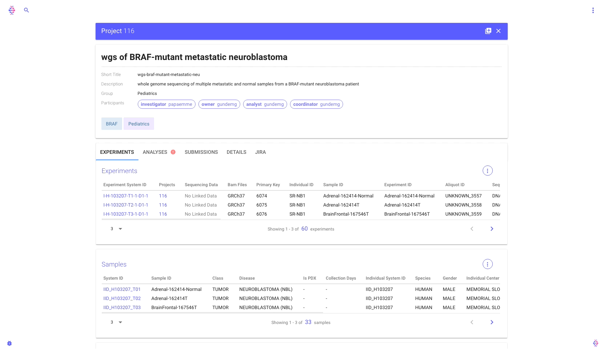

# Retrieving Data

## Introduction to Filters

**Filters** enable you to subset the data of your interest. For example you can use filters to retrieve all the BAM files of a given project, or get all VCFs from a given variant calling application. Filters are _field-value_ pairs and can be used both in the Command Line and within Python. Check out this examples:



```bash
curl http://my-isabl.io/api/v1/experiments?sample__identifier=the-sample-id
```





```bash
isabl get-outdirs -fi application.name BWA_MEM -fi status SUCCEEDED
```





```python
import isabl_cli as ii
samples = ii.get_instances('samples', individual__species="HUMAN")
```




Note that fields can _traverse_ the relational model. To do so concatenate the fields with `__` \(e.g. `samples__disease__acronym=AML`, or a dot in the Command Line `application.name=PINDEL`\)


### Filters Modifiers

As indicated in the previous _hint_, filter fields can traverse database relationships. However, all filters can be augmented using _lookups:_



```python
{related_filter}__{related_field}="query"
```

Here is a quick representation of Isabl's relational model, hence related filters:





Furthermore, all query parameters in this API support advanced lookup types:

| Lookup Type | Description | Example |
| :--- | :--- | :--- |
| **`!`** | Negate any query | `name!=isabel` |
| **`[i]exact`** | Exact match | `name__exact=isabl`  `name__iexact=IsAbL` |
| **`[i]contains`** | Value contains query | `name__contains=isa`  `name__icontains=iSa` |
| **`[i]startswith`** | Value starts with query | `name__startswith=isab`  `name__istartswith=iSab` |
| **`[i]endswith`** | Value starts with query | `name__endswith=bl`  `name__iendswith=bL` |
| **`in`** | Comma separated query | `name__in=isabl,besuhof` |
| **`isnull`** | Value is null | `name__isnull=true` |
| **`regex`** | Use regex pattern | `name__regex=isabl` |
| **`gt`** | Greater than | `total__gt=1` |
| **`gte`** | Greater or equal | `total__gte=1` |
| **`lt`** | Less than | `total__lt=1` |
| **`lte`** | Less than or equal | `total__lte=1` |



Moreover, _Datetime_ query parameters support extra lookups:

| Lookup Type | Description | Example |
| :--- | :--- | :--- |
| \`\` | No lookup, `ISO` format required | `created=` |
| **`date`** | Filter by date `YYYY-MM-DD`. | `created__date=2016-06-04`  `created__date__gt=2016-06-04` |
| **`day`** | Filter by day `DD` | `created__day=04` |
| **`month`** | Filter by month `MM` | `created__month=06` |
| **`year`** | Filter by year `YYYY` | `created__year=2016` |
| **`time`** | Filter by time `HH-MM-SS` | `created__time=21:00:51` |








To get a full description of all available filters please visit Isabl's Redoc API documentation by [https://isabl.mskcc.org/api/v1 ](https://isabl.mskcc.org/api/v1/)\(or replacing `isabl.mskcc.org` with your own host.\) Another useful way to explore the relational model is by using [`isabl get-metadata`](retrieve-data.md#dynamically-explore-metadata).


### Common Filters

Here are some common and useful filters for Isabl.

#### Limit vs Count Limit

The filter `count_limit` enables you to limit the total number of instances that will be retrieved. For example to get the output directory for the first 10 successful analyses you could do:

```bash
isabl get-outdirs -fi status SUCCEEDED -fi count_limit 10
```

On the other side, `limit` will determine how many instances should be retrieved at the same time. For example, the following command would retrieve paths to _all_ successful analyses in batches of 10000:

```bash
isabl get-outdirs -fi status SUCCEEDED -fi limit 100000
```

#### Has BAM File

To get for example all experiments that have a BAM file for `GRCh37` you could do:

```python
experiments = ii.experiments(has_bam_for="GRCh37")
```

### Performance Filters

The following filters can be used to \(quite dramatically\) improve the performance for some queries:

| Filter | Description | Usage |
| :--- | :--- | :--- |


| &lt;/table&gt; | **`distinct`** | If you set distinct to _false_, the each result within the query won't be guaranteed to be unique, yet the response will be faster. | `distinct=false` |
| :--- | :--- | :--- | :--- |


| **`paginator`** | By activating the _cursor_ pagination, you would be able to traverse queries results, but you won't know the total number of results. | `paginator=cursor` |
| :--- | :--- | :--- |



`paginator=cursor` is still experimental, please [report an issue](https://github.com/isabl-io/api/issues/new/choose) if you have trouble.


## Isabl Command Line Client

Filters in the command line are usually provided using the `-fi` or `--filters` flags. Relations or lookups can be provided using double underscores or dots \(e.g. `application.name` or `application__name`\). Here is a list of Isabl commands available to retrieve information:

| Command | Description | Example |
| :--- | :--- | :--- |
| **`get-count`** | Get count of database instances given a particular query. For example, how many failed analyses are in the system? | `isabl get-count analyses -fi status FAILED` |
| **`get-metadata`** | Retrieve instances metadata in multiple formats. To limit the number of fields you are interested in use `-f` \(i.e. [`--fields`](retrieve-data.md#dynamically-explore-metadata)\). | `isabl get-metadata samples -fi category TUMOR -f disease` |
| **`get-data`** | This command will retrieved the _raw_ data linked to experiments as imported in Isabl \(e.g. BAM, FASTQ, CRAM\). Use `--verbose` to see what experiments have _**missing**_ data. | `isabl get-data -fi projects.pk.in 102,103` |
| **`get-bams`** | Get the _official_ bam registered for a given list of experiments. Use `--assembly`if there are BAMs available for different versions of the genome. Use [`has_bam_for`](retrieve-data.md#has-bam-file) to filter those experiments with a registered BAM. | `isabl get-bams -fi has_bam_for GRCh37` |
| **`get-reference`** | Isabl supports the linkage of auxiliary resources to the _assembly_ instances. [By default](retrieve-data.md#assembly-resources)`get-reference` gives you the path to the reference FASTA, however you can retrieve other linked resources. | `isabl get-reference GRCh37` |
| **`get-bed`** | Retrieve a BED file linked to a particular sequencing technique. By default, the _targets_ BED file is returned, to get the _baits_ BED use `--bed-type`. | `isabl get-bed HEMEPACT --assembly GRCh37` |
| **`get-paths`** | Retrieve the storage directory for any instance in the database. Use [`--pattern`](retrieve-data.md#retrieving-application-results) to retrieve files within those directories. | `isabl get-paths projects 102` |
| **`get-outdirs`** | This command is a short cut of `isabl get-paths analyses`. Learn more about retrieving results [here](retrieve-data.md#retrieving-application-results). | `isabl get-outdirs -fi name PINDEL -fi status SUCCEEDED` |
| **`get-results`** | Retrieve analyses results produced by applications. Use [`--app-results`](retrieve-data.md#retrieving-application-results)to list all available choices for a given application. | `isabl get-results -fi application.pk 1 -r command_script` |

### Dynamically Explore Metadata

Another useful way to explore the relational model is by using `isabl get-metadata`:

```bash
isabl get-metadata experiments --fx
```



Expand and navigate with arrow keys, press e to _expand all_ and E to minimize. Learn more at [`fx` documentation](https://github.com/antonmedv/fx/blob/master/docs.md#interactive-mode). Use `--help` to learn about other ways to visualize metadata \(e.g. `tsv`\).


Furthermore, you can limit the amount of information you are retrieving by passing the list of fields you are interested in:

```bash
isabl get-metadata analyses -f application.name -f status
```

### Assembly Resources

By default, the command `get-reference` helps you retrieve the assembly reference genome.

```bash
isabl get-reference GRCh37    # retrieve reference genome
```

However, by means of the `--data-id` flag, the command `get-reference` also allows you to retrieve the indexes generated during import. To get a list of available files per assembly use `--resources`:

```bash
$ isabl get-reference GRCh37 --resources

    genome_fasta         Reference Genome Fasta File.
    genome_fasta_fai     Index generated by: samtools faidx
    ...
```

Then get the one you are interested in with:

```bash
isabl get-reference GRCh37 --data-id genome_fasta_fai
```

### Retrieving Application Results

You can use `get-outdirs` within the command line to systematically explore output directories. For example:

```bash
isabl get-outdirs -fi status FAILED | xargs tree -L 2
```

Further more you can retrieve files within those directories by using `--pattern`:

```bash
isabl get-outdirs -fi status FAILED --pattern 'head_job.*'
```

Additionally, you can retrieve results directly registered by the application:

```bash
for i in `isabl get-results -fi status FAILED -r command_err`; do
   echo exploring $i;
   cat $i;
done
```

To visualize what results are available for a given application run:

```bash
isabl get-results --app-results <application primary key>
```


You can retrieve the application primary key from the front end.


## Isabl Software Development Kit

Importantly, `isabl-cli` can also be used as a Software Development Kit within python:



```python
import isabl_cli as ii  # ii stands for `isabl interactive` 😎
```




If you are using `ipython`, use `?` to get help on a method \(e.g. `ii.get_instances?`\)


### Getting Instances

To get started, we can retrieve specific instances from the database:

```python
# retrieve an experiment with a system id (primary keys also work)
experiment = ii.Experiment("DEM_10000_T01_01_TD1")

# we can also get an analysis using it's primary key (we'll limit retrieved fields)
analysis = ii.Analysis(10235, fields="status,application")

# same thing for assemblies
assembly = ii.Assembly("GRCh37")
```


These instances are [`Munch`](https://github.com/Infinidat/munch), in other words they are dot-dicts \(like javascript\). So you can do both `analysis["status"]` or `analysis.status`.


A more general way to retrieve _any_ object in the database is using `get_instance`:

```python
project = ii.get_instance("projects", 100)  # the signature is (endpoint, identifier)
```

Some examples of things you can do with these instances:

```python
# get the target experiment or tumor
target = analysis.targets[0]

# print the experiment sample class
print(experiment.sample.category)

# see available analysis fields
print(analysis.keys())

# see all available data
print(vars(assembly))
```

To get multiple instances you can do:

```python
# get all TUMOR experiments in project 102
experiments = ii.get_experiments(projects=102, sample__category="TUMOR")

# get the first 10 SUCCEEDED analyses in the same project
analyses = ii.get_experiments(projects=102, status="SUCCEEDED", count_limit=10)

# get all the projects where I'm the owner
projects = ii.get_projects(owner__startswith="besuhof")
```

Similarly to `isabl get-count` , you can determine the number of available results for a given query:

```python
ii.get_instances_count("analyses", status="FAILED")
```

### Getting all Samples from an Individual

To retrieve all samples and experiments for a given individual:

```python
# you can also use the individual system_id
individual = ii.get_tree(10000)

# them all samples are available at
samples = individual.sample_set

# and all experiments for a given sample
experiments = samples[0].experiment_set
```

You can also retrieve multiple _trees:_

```python
individuals = ii.get_trees(projects=267)
```

### Create, Delete, and Modify Instances

If you have permissions, you will be able to systematically alter instances in the database:

```python
# create a disease
ii.create_instance("diseases", name="Osteosarcoma", acrynom="OS")

# update an individual's gender
ii.update_instance(individual.pk, gender="UNKNOWN")

# delete an analysis
ii.delete_instance("analyses", analysis.pk)
```


_With great power, comes..._ yeah you know how it goes. Just be careful.


### Isabl SDK Utils

Here are other useful utilities available in `isabl-cli`:

| Method | Description |
| :--- | :--- |
| `ii.api.chunks` | Given a list of elements, return a list of chunks of `n` elements from the original list. |
| `ii.api.api_request` | Perform an authenticated request to Isabl API. |
| `ii.api.retry_request` | Retry an HTTP request multiple times with a delay between each failure. |

## **Isabl Web**

Isabl Web is a great tool to retrieve information and understand the state of affairs within the system. Simply type something in the search bar to retrieve instances across multiple schemas:


Multiple panels will be stacked horizontally as you request more information:


### **Projects Detail Panel**

The projects detail panel conveys all assets and stakeholders linked to a particular project:



_Live Tables_ are directly wired to the API and will enable you to search and filter on specific columns. For the later, simply click in the column name:


### **The Samples View**

The _samples tree_ panel provides access to all assets generated on a given individual.


By clicking on a given node in the tree, you can retrieve more metadata, filter out available analyses on that instance, and even get access to BAM files:


### Analyses Results

We can retrieve different types of results for all analyses generated by Isabl. For example accessing a project level quality control report:


Similarly we can retrieve other types of results such as a VCF:


